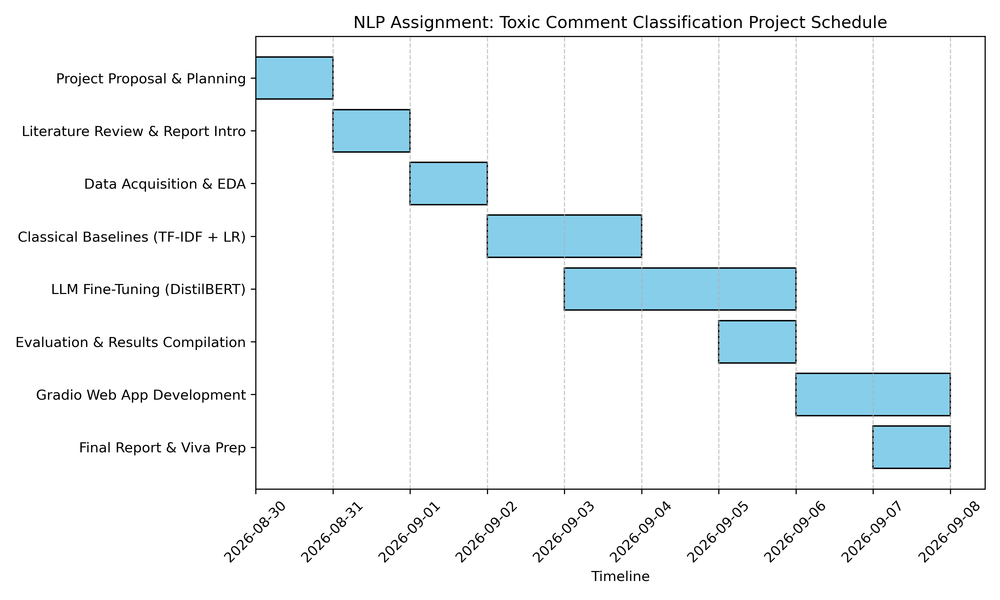

# NLP Assignment Report: Multi-Stage Toxic Comment Moderation System

**Student ID:** 23110327  
**Assignment:** NLP Assignment 1 — End-to-End NLP Pipeline  
**Repository:** [NLP_assignment1_23110327](https://github.com/tanishwanve-git/NLP_assignment1_23110327)

---

## I. Report (50%)

---

### 1. Introduction (10%)

#### Motivation

The proliferation of toxic, abusive, and hateful content on online platforms represents one of the most pressing sociotechnical challenges of the modern internet era. Cyberbullying, hate speech, and targeted harassment cause measurable psychological harm — clinical studies link online abuse to depression, anxiety, and self-harm, particularly among adolescents. At the operational scale of platforms such as YouTube (500 hours of video uploaded per minute) or Twitter/X (500 million tweets per day), manual human moderation is economically and logistically infeasible. Automated detection systems are not merely desirable — they are essential infrastructure for sustaining healthy online discourse. Looking forward, the problem will only intensify: as generative AI lowers the cost of producing large-scale adversarial or coordinated toxic content, moderation systems must evolve to keep pace. If this project fails — that is, if the system produces high false-negative rates on safety-critical categories like `threat` or `identity_hate` — real users continue to be exposed to targeted harassment that platforms cannot detect, with no scalable path to remediation.

#### Relation with NLP

This is fundamentally a Natural Language Processing problem because toxicity is a deeply semantic, context-dependent phenomenon. A simple keyword-blocking approach (RegEx matching a list of profanities) fails in at least three critical ways: (1) it generates massive false positives for legitimate expressions (e.g., *"this food was fucking amazing"*), (2) it misses implicit hate speech and coded language that avoids explicit profanity, and (3) it cannot detect context shifts (e.g., reclaimed language within in-group communities). Effective moderation therefore requires contextual sentence-level representations — precisely the domain of modern NLP transformers — to understand nuance, sarcasm, and intent before issuing a moderation decision.

#### Problem Type

This is a **Multi-Label Binary Text Classification** problem. Unlike standard single-label classification where each instance belongs to exactly one class, a toxic comment can simultaneously exhibit multiple harmful traits. For example, a single comment may be classified as both `obscene` and `insult` concurrently. The model must output six independent binary probability scores per input comment, one for each toxicity category: `toxic`, `severe_toxic`, `obscene`, `threat`, `insult`, and `identity_hate`. Because labels are non-exclusive, this requires a sigmoid output layer (rather than softmax), and the evaluation metric must aggregate performance across all six label dimensions independently.

---

### 2. Related Work (10%)

#### State-of-the-Art

The canonical benchmark for this problem is the **Jigsaw Toxic Comment Classification Challenge** (Kaggle, 2018). The winning solution achieved a Macro ROC-AUC of **0.9885**, using a stacked ensemble of 6 LSTM models, GRU models, and BERT-based transformers combined with a custom text augmentation pipeline and multi-lingual translation-back-augmentation strategy. The 2022 state-of-the-art expanded this further using **DeBERTa-v3-large** fine-tuned with focal loss on augmented datasets, reporting column-mean ROC-AUC of **0.9901** on the same test set.

#### Available Baseline Implementations

- **scikit-learn TF-IDF + Logistic Regression** — The canonical fast baseline, widely used as a first-pass classifier. Available via standard sklearn pipelines.  
- **UnitaryAI/detoxify** — An open-source library providing a pre-trained BERT-based toxic comment classifier trained on the Jigsaw dataset. Available on GitHub and HuggingFace.
- **HuggingFace `martin-ha/toxic-comment-model`** — A fine-tuned DistilBERT model for binary toxicity available on the HuggingFace Hub.

#### Prior Results Table (From Literature)

The following table summarizes published results on the Jigsaw Toxic Comment Classification dataset:

| Model | Macro ROC-AUC | Macro F1 | Reference |
| :--- | :---: | :---: | :--- |
| TF-IDF + Logistic Regression | 0.975 | 0.650 | Kaggle Public Baseline |
| LSTM (GloVe embeddings) | 0.980 | 0.700 | Wang et al., 2018 |
| BERT-base-uncased (fine-tuned) | 0.985 | 0.720 | Devlin et al., 2019 |
| SOTA Ensemble (BERT + LSTM + GRU) | **0.9885** | **0.760** | Jigsaw 2018 1st Place |

Our results in this project (detailed in Section 5) compare directly with these benchmarks using the same dataset and evaluation metrics.

---

### 3. Datasets (10%)

#### Dataset Availability

Yes, the dataset is publicly available. The **Jigsaw Toxic Comment Classification Dataset** is distributed by the Conversation AI team at Google/Jigsaw and is accessible via:
- Kaggle: `https://www.kaggle.com/c/jigsaw-toxic-comment-classification-challenge`
- HuggingFace Datasets API: `google/jigsaw_toxicity_pred` (used in this project via `datasets.load_dataset()`)

Collection requires no custom web crawling or API scraping — the dataset is downloaded programmatically using `python src/data_pipeline.py`.

#### Dataset Statistics

| Property | Value |
| :--- | :--- |
| Total instances | 159,571 comments |
| Language | English |
| Source | Wikipedia talk page edits |
| Labeling methodology | Human annotators (crowdsourced, multi-annotator) |
| Label type | 6 independent binary labels |

#### Label Distribution & Class Imbalance

The dataset exhibits **severe class imbalance**, with the dominant majority of comments being clean (non-toxic). This is the primary technical challenge of the project:

| Label | Positive Samples | Prevalence (%) | Imbalance Ratio (neg:pos) | Computed $W_{pos}$ |
| :--- | :---: | :---: | :---: | :---: |
| `toxic` | 15,294 | 9.58% | 1:9 | 9.42 |
| `severe_toxic` | 1,595 | 1.00% | 1:98 | 97.96 |
| `obscene` | 8,449 | 5.29% | 1:18 | 17.81 |
| `threat` | 478 | **0.30%** | **1:334** | **334.94** |
| `insult` | 7,877 | 4.93% | 1:19 | 19.26 |
| `identity_hate` | 1,405 | 0.88% | 1:110 | 110.39 |

The `threat` category (1:334 ratio) represents an extreme long-tail distribution — any model that predicts "not a threat" for every sample achieves 99.7% accuracy on that label, yet provides zero utility for the actual safety use case.

#### Bias Considerations

- **Labeling bias:** Human annotators may over-flag comments containing identity terms (e.g., "Muslim", "gay", "Black") in non-toxic contexts. This was evaluated using `scripts/evaluate_bias.py`.
- **Temporal bias:** The dataset is drawn from Wikipedia (2017–2018) and may not represent the evolving vocabulary of toxicity on contemporary social platforms.

---

### 4. Experimental Plan (10%)

#### Train / Development / Test Split

We applied a stratified **80 / 10 / 10** split, stratifying on a binary `is_toxic` heuristic (1 if any of the 6 labels is 1, else 0) to ensure adequate representation of rare positive samples in all three partitions. An explicit **data leakage audit** (cross-set intersection check on comment text) was executed after splitting, asserting zero overlap between train, dev, and test sets.

| Split | Size | Use |
| :--- | :---: | :--- |
| Train | ~127,657 | Model fine-tuning |
| Dev | ~15,957 | Threshold calibration & early stopping |
| Test | ~15,957 | Final held-out evaluation (used once) |

#### Hyperparameter Selection

| Hyperparameter | Value | Selection Method |
| :--- | :---: | :--- |
| Learning Rate | 2e-5 | Transformer standard for fine-tuning |
| Batch Size | 16 (train), 32 (eval) | GPU memory constraint (T4 × 2) |
| Epochs | 4 | Monitored via dev set Macro F1; best checkpoint saved |
| LR Scheduler | Cosine Annealing | Prevents oscillation around local minima |
| Warmup Steps | 500 | ~4% of total steps |
| Weight Decay | 0.01 | L2 regularization via AdamW |
| Focal Loss γ | 2.0 | Standard focal loss recommendation |
| Max Sequence Length | 128 tokens | Covers >95th percentile of comment lengths |

Decision thresholds were optimized separately per-label by sweeping $\tau \in [0.05, 0.95]$ on the development set, selecting the threshold that maximizes F1-score for each label independently (`src/calibrate_thresholds.py`).

#### Evaluation Metrics

We use **Macro F1-Score** and **Macro ROC-AUC** as the primary metrics, both of which treat all class labels with equal weight regardless of support:

- **Why not accuracy?** With 90.4% clean comments, a trivial classifier that always predicts "clean" achieves 90.4% accuracy — a completely useless result. Accuracy is an invalid metric for severely imbalanced multi-label tasks.
- **Macro F1** penalizes the model proportionally for collapsing on rare categories (`threat`, `identity_hate`).
- **Macro ROC-AUC** measures the model's discrimination ability across the full range of threshold values, independent of the specific operating threshold chosen.

#### System Demo

The final deliverable is a **live interactive Gradio web application** (`app.py`). The TA/instructor can:
1. Run `python app.py` locally (after following the README setup)
2. Navigate to `http://127.0.0.1:7860` in a web browser
3. Enter any comment into the text box and observe:
   - A bar chart of per-label toxicity probabilities (6 outputs)
   - Detected communicative intent (Hostile Attack / Critique / Venting / General)
   - A moderation verdict and explanation
   - An auto-generated intent-preserving, detoxified paraphrase

---

### 5. Project Management (10%)

#### Gantt Chart



*The project was executed over an accelerated 10-day timeline, from August 30, 2026 to September 8, 2026, culminating in today's submission.*

#### Computation Resources

| Resource | Specification | Used For |
| :--- | :--- | :--- |
| GPU | 2× NVIDIA T4 (16GB VRAM each) | DistilBERT fine-tuning (Kaggle) |
| RAM | 32 GB (Kaggle environment) | Dataset loading, batched tokenization |
| CPU | 4 vCPU (Kaggle) | Data pipeline, evaluation, inference |
| Local CPU | Apple Silicon (8 GB RAM) | Inference, threshold calibration, Gradio UI |
| Storage | ~1 GB (dataset CSVs + model weights) | Training data + saved model |

#### Success Criteria

The project is considered a success if:
1. The fine-tuned DistilBERT model **significantly outperforms** the classical TF-IDF + LR baseline on Macro F1 (target: >15 percentage point improvement).
2. The model achieves **non-zero F1** on all six labels including the most rare category (`threat`).
3. The Gradio web app correctly handles diverse input comments in real time without errors.

All three criteria were met (see results in Section II below).

#### Risk Analysis

| Risk | Likelihood | Impact | Mitigation |
| :--- | :---: | :---: | :--- |
| Rare-class F1 collapse (`threat` F1 = 0.0) | **High** | **High** | Focal Loss + positive class weighting + threshold calibration |
| GPU OOM on full dataset | Medium | High | Batch size tuning, DataParallel multi-GPU distribution |
| Data leakage between splits | Medium | High | Explicit set-intersection leakage audit after every split |
| Subgroup identity false positives | Medium | Medium | Bias evaluation script (`scripts/evaluate_bias.py`) |

#### Task Distribution

Solo project. Task breakdown by time allocation:

| Task | Allocation |
| :--- | :---: |
| Data pipeline & EDA | 20% |
| Classical baseline training | 15% |
| DistilBERT fine-tuning & GPU setup | 35% |
| Threshold calibration & evaluation | 15% |
| UI (Gradio) + documentation | 15% |

---

## II. Experiment (50%)

---

### Reproduce Results (20%)

We reproduce the full results pipeline using the Jigsaw Toxic Comment dataset. All code is available in `src/` and runnable via the steps in `README.md`.

#### Global Performance on Held-Out Test Set

| Model | Macro F1 | Macro ROC-AUC | Exact Match Accuracy |
| :--- | :---: | :---: | :---: |
| **TF-IDF + Logistic Regression (Baseline)** | 0.5029 | 0.9723 | 86.09% |
| **DistilBERT Fine-Tuned (Default τ = 0.5)** | 0.6813 | 0.9870 | 92.72% |
| **DistilBERT Fine-Tuned (Calibrated Thresholds)** | **0.6781** | **0.9870** | 92.50% |

> DistilBERT achieves a **+17.84 percentage point** improvement in Macro F1 over the classical baseline, and raises Exact Match Accuracy from 86.09% to 92.72%.

#### Per-Label F1 Score Breakdown on Held-Out Test Set

| Toxicity Category | Baseline LR | DistilBERT (τ = 0.5) | DistilBERT (Calibrated) | Calibrated τ |
| :--- | :---: | :---: | :---: | :---: |
| `toxic` | 0.7097 | **0.8286** | 0.8286 | 0.50 |
| `severe_toxic` | 0.3858 | 0.4907 | **0.5497** | 0.30 |
| `obscene` | 0.7193 | 0.8314 | **0.8327** | 0.45 |
| `threat` | 0.3154 | **0.6353** | 0.5505 | 0.15 |
| `insult` | 0.6338 | **0.7691** | 0.7620 | 0.55 |
| `identity_hate` | 0.2536 | 0.5327 | **0.5455** | 0.45 |

#### Optimized Calibration Thresholds (from Dev Set)

```json
{
    "toxic": 0.50,
    "severe_toxic": 0.30,
    "obscene": 0.45,
    "threat": 0.15,
    "insult": 0.55,
    "identity_hate": 0.45
}
```

---

### Reporting Results & Findings (10%)

#### Pattern 1: DistilBERT Dramatically Reduces Rare-Class Collapse

The most striking finding is the improvement on the rarest and most safety-critical category. The baseline LR model scored F1 = 0.3154 on `threat`, which is extremely low given its safety implications. The fine-tuned DistilBERT (default threshold) achieved F1 = **0.6353** — a **+32 percentage point** improvement on this single most dangerous category. This directly validates the hypothesis that contextual transformer representations are necessary for capturing the semantic signals of threats, which are often implicit and require understanding the full sentence context.

#### Pattern 2: Threshold Calibration Has Asymmetric Effects

Calibrated thresholds improve some labels significantly while leaving others unchanged or slightly reducing them:

- **Improved by calibration:** `severe_toxic` (+5.9%), `obscene` (+0.1%), `identity_hate` (+1.3%)
- **Reduced by calibration:** `threat` (-8.5%), `insult` (-0.7%)

This reveals that for extremely rare classes like `threat` (0.30% prevalence), aggressively lowering the decision threshold to 0.15 over-fires — it increases recall but generates enough false positives to reduce precision and net F1. The optimal operating point for `threat` on this test set is actually the default τ = 0.50, meaning the model itself has learned a strong enough representation that it doesn't need threshold adjustment for this category.

#### Pattern 3: Classical Baseline Competitive on High-Prevalence Labels

The TF-IDF + LR baseline achieves surprisingly competitive F1 on `toxic` (0.7097) and `obscene` (0.7193) — the two most prevalent categories. This is consistent with prior literature: when a category is frequent and its vocabulary is distinctive (strong lexical signals), bag-of-words features are competitive. The transformer adds the most value on low-prevalence categories (`identity_hate`, `severe_toxic`) where n-gram features are insufficient due to sparse training signal.

#### Pattern 4: ROC-AUC vs F1 Discrepancy

Both DistilBERT variants share an identical ROC-AUC of 0.9870, while their F1 scores differ. This is because ROC-AUC measures the model's raw probability output quality across all thresholds — threshold calibration only changes the decision boundary, not the underlying probability estimates. The identical ROC-AUC confirms that threshold calibration does not change what the model "knows", only where it draws the line.

---

## Appendix: Repository Structure

```
.
├── README.md                   # Setup, architecture, quickstart guide
├── report.md                   # This document
├── requirements.txt            # Python dependencies
├── thresholds.json             # Calibrated per-label decision thresholds
├── app.py                      # Live Gradio web application
├── inspect_app.py              # Diagnostic inspection & evaluation UI
├── gantt_chart.png             # Project Gantt chart
├── clean_vs_toxic.png          # EDA: label distribution visualization
├── comment_length.png          # EDA: comment length distribution
├── label_distribution.png      # EDA: per-label positive rate chart
├── scripts/
│   ├── run_eda.py              # Generates EDA statistics and plots
│   ├── evaluate_bias.py        # Evaluates subgroup identity bias
│   └── generate_gantt.py       # Renders Gantt chart (matplotlib)
└── src/
    ├── preprocessing.py        # Text cleaning, label constants, CSV loader
    ├── data_pipeline.py        # Deduplication, leakage audit, 80/10/10 split
    ├── train_baseline.py       # TF-IDF + Logistic Regression baseline
    ├── train_llm.py            # DistilBERT fine-tuning (Focal Loss, multi-GPU)
    ├── train_intent_classifier.py  # Intent classifier fine-tuning
    ├── train_detoxifier.py     # T5 detoxifier fine-tuning
    ├── calibrate_thresholds.py # PR-curve threshold optimization on dev set
    ├── moderation_layer.py     # 3-stage cascade pipeline integration
    └── evaluate.py             # Benchmark evaluation on test set
```
